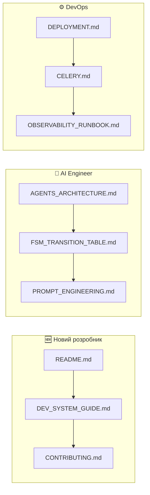

# 📚 MIRT AI — Центральний Індекс Документації

> **Оновлено:** 20 грудня 2025  
> **Версія архітектури:** 5.0 (Enterprise Agentic System)  
> **Статус:** ✅ Production Ready

---

## 🎯 Швидка Навігація



---

## 📁 Структура Документації

```
Mirt-AI/
│
├── 📖 РІВЕНЬ 0: КОРІНЬ ─────────────────────────────────────────
│   ├── README.md                    🌟 Головний огляд проекту
│   ├── DOCUMENTATION.md             📚 ЦЕЙ ФАЙЛ - центральний індекс
│   └── PRD.md                       📋 Product Requirements Document
│
├── 📜 РІВЕНЬ 1: ПРАВИЛА (.rules/) ──────────────────────────────
│   └── rulesllm.md                  ⚖️ Правила для AI/LLM
│
├── 📚 РІВЕНЬ 2: ТЕХНІЧНА ДОКУМЕНТАЦІЯ (docs/) ──────────────────
│   │
│   ├── 🏗️ АРХІТЕКТУРА
│   │   ├── ARCHITECTURE.md          Загальна архітектура
│   │   ├── AGENTS_ARCHITECTURE.md   LangGraph + 12 нод
│   │   └── FSM_TRANSITION_TABLE.md  10 станів + 14 фаз
│   │
│   ├── 👨‍💻 РОЗРОБКА
│   │   ├── DEV_SYSTEM_GUIDE.md      Гайд розробника
│   │   ├── CONTRIBUTING.md          Правила контрибʼюції
│   │   ├── TESTING.md               Стратегія тестування
│   │   └── PROMPT_ENGINEERING.md    Робота з промптами
│   │
│   ├── ⚙️ ОПЕРАЦІЇ
│   │   ├── DEPLOYMENT.md            Railway/Docker деплой
│   │   ├── DEPLOYMENT_VPS.md        VPS деплой
│   │   ├── CELERY.md                Celery workers
│   │   └── OBSERVABILITY_RUNBOOK.md Моніторинг
│   │
│   └── 🔗 ІНТЕГРАЦІЇ
│       ├── MANYCHAT_SETUP.md        ManyChat налаштування
│       └── SITNIKS_INTEGRATION.md   CRM інтеграція
│
├── 🧠 РІВЕНЬ 3: AI ПРОМПТИ (data/prompts/) ─────────────────────
│   ├── system/main.md               Головний системний промпт
│   ├── vision/                      Vision Agent промпти
│   └── states/STATE_*.md            FSM State промпти (0-9)
│
└── 🔧 РІВЕНЬ 4: СКРИПТИ (scripts/) ─────────────────────────────
    └── README_TELEGRAM_BOT.md       Запуск Telegram бота
```

---

## 📋 Матриця Документів

### За Призначенням

| Документ | Аудиторія | Призначення |
|:---------|:----------|:------------|
| `README.md` | Всі | Перший погляд на проект |
| `PRD.md` | PM / Stakeholders | Product Requirements |
| `docs/ARCHITECTURE.md` | Всі розробники | Загальна архітектура |
| `docs/AGENTS_ARCHITECTURE.md` | AI Engineers | LangGraph деталі |
| `docs/FSM_TRANSITION_TABLE.md` | Всі розробники | FSM стани |
| `docs/DEV_SYSTEM_GUIDE.md` | Розробники | Швидкий старт |
| `docs/TESTING.md` | QA / Dev | Тестування |
| `docs/DEPLOYMENT.md` | DevOps | Деплой |
| `docs/CELERY.md` | Backend Dev | Workers |
| `docs/OBSERVABILITY_RUNBOOK.md` | SRE / DevOps | Моніторинг |
| `.rules/rulesllm.md` | AI Agents | Правила для LLM |

### За Статусом

| Статус | Документи |
|:-------|:----------|
| ✅ **Актуальні** | Всі основні документи оновлені |
| 📜 **Legacy** | `docs/IMPLEMENTATION_STATUS.md`, `docs/AUDIT_REPORT_2024_12_11.md` |
| 🗺️ **Roadmap** | `docs/PRODUCTION_IMPROVEMENT_PLAN.md` |

---

## 🔗 Cross-References

### Архітектура

- **Головний опис:** `docs/ARCHITECTURE.md`
- **Агенти:** `docs/AGENTS_ARCHITECTURE.md`
- **FSM:** `docs/FSM_TRANSITION_TABLE.md`
- **Правила LLM:** `.rules/rulesllm.md`

### Memory System (Titans-like)

- **Архітектура:** `docs/AGENTS_ARCHITECTURE.md` (розділ Memory)
- **Код:** `src/agents/langgraph/nodes/memory.py`

### Vision

- **Промпт:** `data/prompts/vision/vision_main.md`
- **Код:** `src/agents/langgraph/nodes/vision.py`
- **Каталог:** `data/vision/products_master.yaml`

---

## ⚡ Quick Commands

```bash
# Запуск тестів
pytest tests/ -v

# Запуск сервера
uvicorn src.server.main:app --reload --port 8000

# Celery worker
celery -A src.workers.celery_app worker -l info

# Форматування
ruff format src/
ruff check src/ --fix

# Docker
docker-compose up -d
```

---

## 📌 SSOT (Single Source of Truth)

| Що | Де | НЕ шукати тут |
|:---|:---|:--------------|
| **Архітектура** | `docs/ARCHITECTURE.md` | - |
| **FSM** | `docs/FSM_TRANSITION_TABLE.md` + `src/core/state_machine.py` | - |
| **LangGraph** | `docs/AGENTS_ARCHITECTURE.md` + `src/agents/langgraph/` | - |
| **Промпти** | `data/prompts/` | Hardcoded strings |
| **Товари** | `data/vision/products_master.yaml` | - |

---

> **🎯 ГОЛОВНЕ ПРАВИЛО:**
> 
> Якщо документ не в цьому індексі — він або застарілий, або не існує.
> Якщо ти створюєш новий документ — додай його сюди.

---

> **Оновлено:** 20 грудня 2025, 13:38 UTC+2
