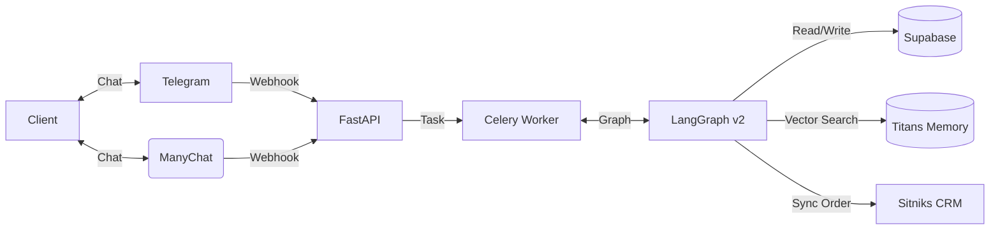

# 📋 MIRT AI — Product Requirements Document

> **Version:** 2.0 (Implementation)  
> **Updated:** 20 December 2025  
> **Status:** ✅ Production Ready

---

## 🎯 Product Vision

**MIRT AI** is an intelligent stylist assistant for the MIRT children's clothing brand. It automates 80% of routine interactions while escalating complex cases to human managers.

### Core Value Proposition
1. **Instant Response:** 24/7 availability on Telegram/Instagram.
2. **Visual Search:** Parents can send a photo of a dress and find similar items.
3. **Smart Context:** Remembers the child's age/height (Titans Memory).

---

## 🏗️ Technical Architecture (Implemented)

The system is built on an **Event-Driven Architecture**:

---

## ✅ Feature Matrix (v2.0)

| Feature | Logic Location | Implementation Detail |
|:--------|:---------------|:----------------------|
| **Turn-Based Dialog** | `src.core.state_machine` | 14 Dialog Phases mapped to 10 FSM Nodes. |
| **Vision AI** | `src.agents.langgraph.nodes.vision` | Uses GPT-4o Vision to classify items. |
| **Human-in-the-Loop** | `src.agents.langgraph.graph` | `interrupt_before=["payment"]`. |
| **Memory System** | `src.agents.langgraph.nodes.memory*` | 3-Layer Titans architecture (Profile, Facts, Working). |
| **CRM Integration** | `src.integrations.crm.snitkix` | Full order sync with retry logic. |

---

## 🗺️ Roadmap (Technical Debt & Scale)

### Q1 2026 Priorities
1. **RAG Catalog:** Replace simple search with Vector Search using `pgvector`.
2. **Voice:** Add `Whisper` model for voice message transcription.
3. **Resilience:** Add `CircuitBreaker` pattern to OpenAI calls.

---

## 👥 User Personas

| Persona | Behavior | AI Response |
|:--------|:---------|:------------|
| **"The Urgent Mom"** | Sends photo, asks "How much?" | Vision Node -> Identifies item -> Checks stock -> Returns price. |
| **"The Gift Giver"** | "I need something for a 5yo" | Agent Node -> Discovery Phase -> Suggests "Grow with me" items. |

---
