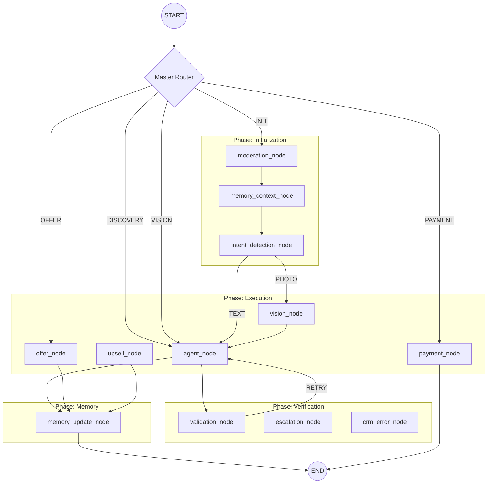

# 🧠 Agents Architecture (LangGraph v2)

> **Version:** 5.0 (Implementation)  
> **Source:** `src/agents/langgraph/graph.py`  
> **Updated:** 20 December 2025

---

## 🏗️ The Graph Structure

The core intelligence is a **StateGraph** utilizing `ConversationState`. It consists of **12 specialized nodes** orchestrated by a master router.



---

## 📝 Nodes Implementation Details

### 1. `moderation_node` (`_moderation`)
- **Input:** Raw text
- **Function:** Checks against OpenAI Moderation API.
- **Output:** If flagged -> `escalation_node`. Else -> `memory_context_node`.

### 2. `memory_context_node` (`_memory_context`)
- **Input:** User ID
- **Function:** Retrieves semantic memories (facts) from Vector DB (`mirt_memories`).
- **Target:** Injects context into `ConversationState["memory_context"]`.

### 3. `intent_detection_node` (`_intent`)
- **Input:** Text + Memory
- **Function:** Classifies intent using `Intent` enum (10 types).
- **Routing:**
  - `PHOTO_IDENT` -> `vision_node`
  - `COMPLAINT` -> `escalation_node`
  - Others -> `agent_node`

### 4. `vision_node` (`_vision`)
- **Model:** GPT-4o
- **Logic:** Identifies product type, color, and potential match in catalog.
- **Output:** Updates `detected_intent` and `image_url`.

### 5. `agent_node` (`_agent`)
- **Agent:** `SupportAgent` (PydanticAI)
- **Duties:** Handling `DISCOVERY`, `SIZE`, `COLOR` phases.
- **Tools:** `search_catalog`, `check_stock`.

### 6. `offer_node` (`_offer`)
- **Logic:** Aggregates `cart_items` and formulates a final proposal.
- **Transition:** Moves state to `STATE_4_OFFER`.

### 7. `payment_node` (`_payment`)
- **Logic:** Handles `WAITING_FOR_PAYMENT_*`.
- **HITL:** **INTERRUPT ENABLED** via `interrupt_before=["payment"]`.
- **Command:** Returns `Command(goto="end")` or `Command(goto="upsell")`.

### 8. `upsell_node` (`_upsell`)
- **Logic:** Analyzes cart and suggests accessories.
- **State:** `STATE_6_UPSELL`.

### 9. `validation_node` (`_validation`)
- **Logic:** **Self-Correction Loop**.
- **Check:** Validates Agent output against business rules (e.g., price consistency).
- **Retry:** If fail -> increments `retry_count` -> loops back to `agent_node`.

### 10. `escalation_node` (`_escalation`)
- **Logic:** Formats message for human manager (`SITNIKS_HUMAN_MANAGER_ID`).
- **State:** `STATE_8_COMPLAINT`.

### 11. `crm_error_node` (`_crm_error`)
- **Trigger:** Failures in `crm` queue tasks.
- **Action:** Apologize to user, log error, notify dev.

### 12. `memory_update_node` (`_memory_update`)
- **Input:** Final interaction state.
- **Function:** Extracts new facts and saves to Vector DB (Titans implementation).
- **Timing:** Runs *silently* before `END`.

---

## 🚦 Routing Logic (`master_router`)

The graph uses a **Turn-Based** approach controlled by `dialog_phase`:

| Phase | Destination Node |
|:------|:-----------------|
| `INIT` | `moderation` (Start full pipeline) |
| `DISCOVERY` | `agent` (Continue search) |
| `VISION_DONE` | `agent` (Discuss result) |
| `SIZE_COLOR_DONE` | `offer` (Make proposal) |
| `OFFER_MADE` | `payment` (Handle checkout) |
| `COMPLETED` | `end` (Finish) |

---

## 🛑 Interrupts (HITL)

Configured in `src/agents/langgraph/graph.py`:

```python
compiled = graph.compile(
    checkpointer=checkpointer,
    interrupt_before=["payment"] if settings.ENABLE_PAYMENT_HITL else [],
)
```

Usage:
1. Graph pauses before `payment`.
2. Admin reviews payment proof.
3. Resume via `resume_after_interrupt(session_id, response=True)`.

---
