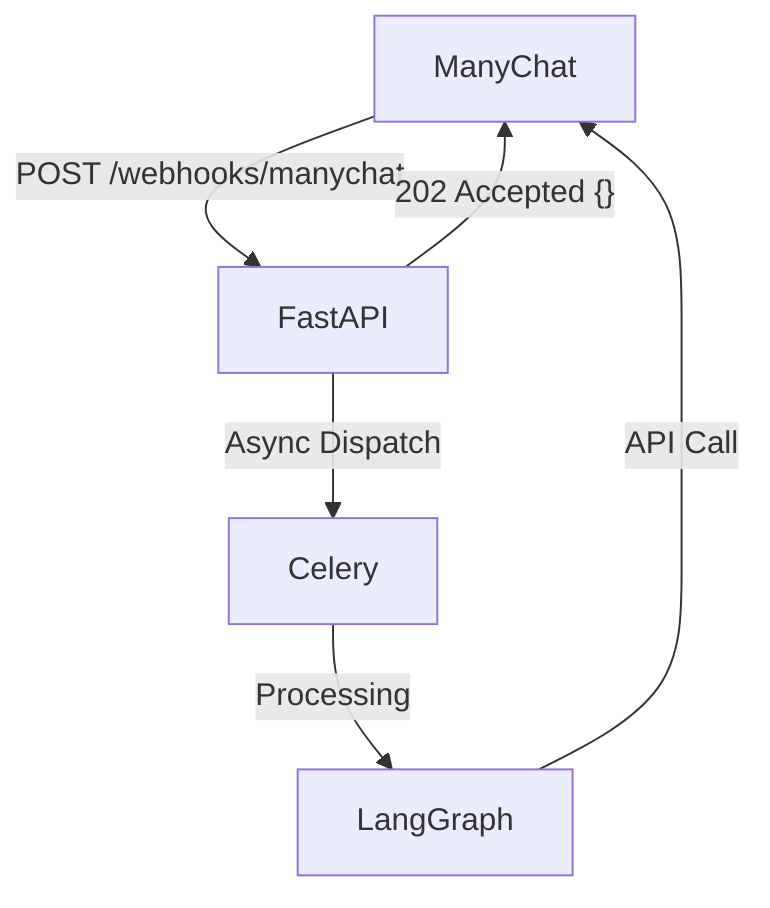
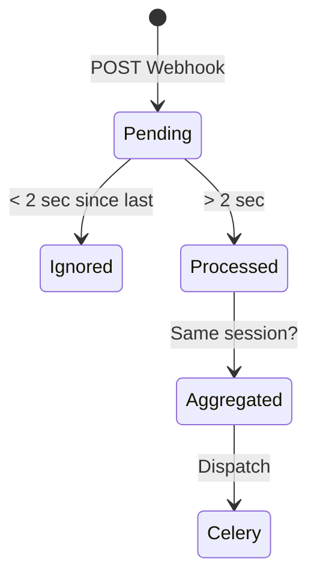

# ⚡ ManyChat Push Mode

> **Версія:** 5.0  
> **Статус:** ✅ Production Ready  
> **SSOT:** `src/integrations/manychat/pipeline.py`

---

## 🏗️ Architecture

MIRT AI використовує **Push Architecture** для обходу обмежень ManyChat (10 секунд timeout) і забезпечення надійної обробки складних запитів (Vision, RAG).



---

## 📊 Comparison

| Feature | Response Mode (Legacy) | Push Mode (Recommended) |
|:--------|:-----------------------|:------------------------|
| **Response Type** | Sync JSON in HTTP Body | Async API Call |
| **Timeout** | ~10.0 seconds | Unlimited (Background) |
| **Retry Logic** | Handled by ManyChat | Handled by Celery |
| **UX** | User waits (typing...) | User free to text |
| **Vision** | ❌ Often timeouts | ✅ Reliable |

---

## ⚙️ Configuration

Set these environment variables in `.env`:

```ini
# Enable Push Mode
MANYCHAT_PUSH_MODE=true

# Use Celery for reliability (Required)
MANYCHAT_USE_CELERY=true

# Credentials
MANYCHAT_API_KEY=...
MANYCHAT_API_URL=https://api.manychat.com
```

---

## 🔄 Debounce Pipeline

Для захисту від duplicate requests (коли користувач тисне кнопку двічі) використовується **Debounce Middleware**.



### Key Logic

1. **Fingerprint:** SHA256(`user_id`, `input_text`, `timestamp`)
2. **Window:** 2-5 секунд (налаштовується)
3. **Storage:** Redis locks

---

## 🛡️ Error Handling

### API Failures
Якщо ManyChat API повертає помилку (5xx, 429), Celery автоматично робить retry з exponential backoff.

| Error | Action |
|:------|:-------|
| `429 Too Many Requests` | Retry-After header |
| `5xx Server Error` | Exp backoff (max 10 min) |
| `401 Unauthorized` | Critical Log (Check Key) |

---

## 📚 Пов'язані документи

| Документ | Опис |
|:---------|:-----|
| [MANYCHAT_SETUP.md](MANYCHAT_SETUP.md) | Налаштування в інтерфейсі |
| [CELERY.md](CELERY.md) | Backoff settings |

---

> **Оновлено:** 20 грудня 2025, 13:48 UTC+2
