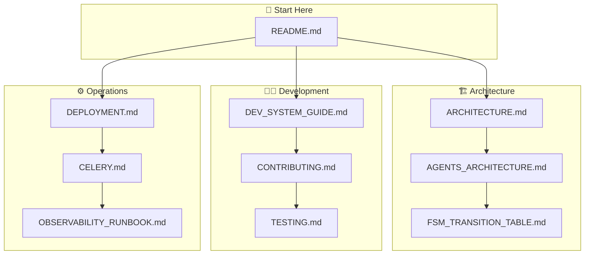

# 📚 Documentation Index

> **Папка:** `docs/`  
> **Оновлено:** 20 грудня 2025

---

## 📊 Quick Navigation

---

## 📁 Document Index

### 🏗️ Architecture

| Document | Description |
|:---------|:------------|
| [ARCHITECTURE.md](ARCHITECTURE.md) | High-level system architecture |
| [AGENTS_ARCHITECTURE.md](AGENTS_ARCHITECTURE.md) | LangGraph nodes & routing |
| [FSM_TRANSITION_TABLE.md](FSM_TRANSITION_TABLE.md) | FSM states & transitions |

### 👨‍💻 Development

| Document | Description |
|:---------|:------------|
| [DEV_SYSTEM_GUIDE.md](DEV_SYSTEM_GUIDE.md) | Developer quick start |
| [CONTRIBUTING.md](CONTRIBUTING.md) | Contribution guidelines |
| [TESTING.md](TESTING.md) | Testing strategy |
| [PROMPT_ENGINEERING.md](PROMPT_ENGINEERING.md) | Prompt management |

### ⚙️ Operations

| Document | Description |
|:---------|:------------|
| [DEPLOYMENT.md](DEPLOYMENT.md) | Railway/Docker deployment |
| [DEPLOYMENT_VPS.md](DEPLOYMENT_VPS.md) | VPS deployment |
| [CELERY.md](CELERY.md) | Celery workers |
| [OBSERVABILITY_RUNBOOK.md](OBSERVABILITY_RUNBOOK.md) | Monitoring & alerts |

### 🔗 Integrations

| Document | Description |
|:---------|:------------|
| [MANYCHAT_SETUP.md](MANYCHAT_SETUP.md) | ManyChat configuration |
| [MANYCHAT_PUSH_MODE.md](MANYCHAT_PUSH_MODE.md) | Push mode details |
| [SITNIKS_INTEGRATION.md](SITNIKS_INTEGRATION.md) | CRM integration |

### 📊 Status & Planning

| Document | Description |
|:---------|:------------|
| [STATUS_REPORT.md](STATUS_REPORT.md) | Current implementation status |
| [IMPLEMENTATION_STATUS.md](IMPLEMENTATION_STATUS.md) | Feature status |
| [PRODUCTION_IMPROVEMENT_PLAN.md](PRODUCTION_IMPROVEMENT_PLAN.md) | Roadmap |
| [SUPABASE_TABLES_ROADMAP.md](SUPABASE_TABLES_ROADMAP.md) | Database roadmap |

### 📋 Historical

| Document | Description |
|:---------|:------------|
| [AUDIT_REPORT_2024_12_11.md](AUDIT_REPORT_2024_12_11.md) | Audit report |
| [TEST_STRATEGY_AUDIT.md](TEST_STRATEGY_AUDIT.md) | Test audit |

---

## 🎯 Reading Order

### For New Developers

1. 📖 `../README.md` — Project overview
2. 🏗️ `ARCHITECTURE.md` — System design
3. 👨‍💻 `DEV_SYSTEM_GUIDE.md` — Setup & commands
4. 🤝 `CONTRIBUTING.md` — How to contribute

### For AI Engineers

1. 🧠 `AGENTS_ARCHITECTURE.md` — LangGraph details
2. 🔀 `FSM_TRANSITION_TABLE.md` — State machine
3. ✏️ `PROMPT_ENGINEERING.md` — Prompts

### For DevOps

1. 🚀 `DEPLOYMENT.md` — Deployment guide
2. ⚙️ `CELERY.md` — Workers
3. 📊 `OBSERVABILITY_RUNBOOK.md` — Monitoring

---

> **Оновлено:** 20 грудня 2025, 13:36 UTC+2
