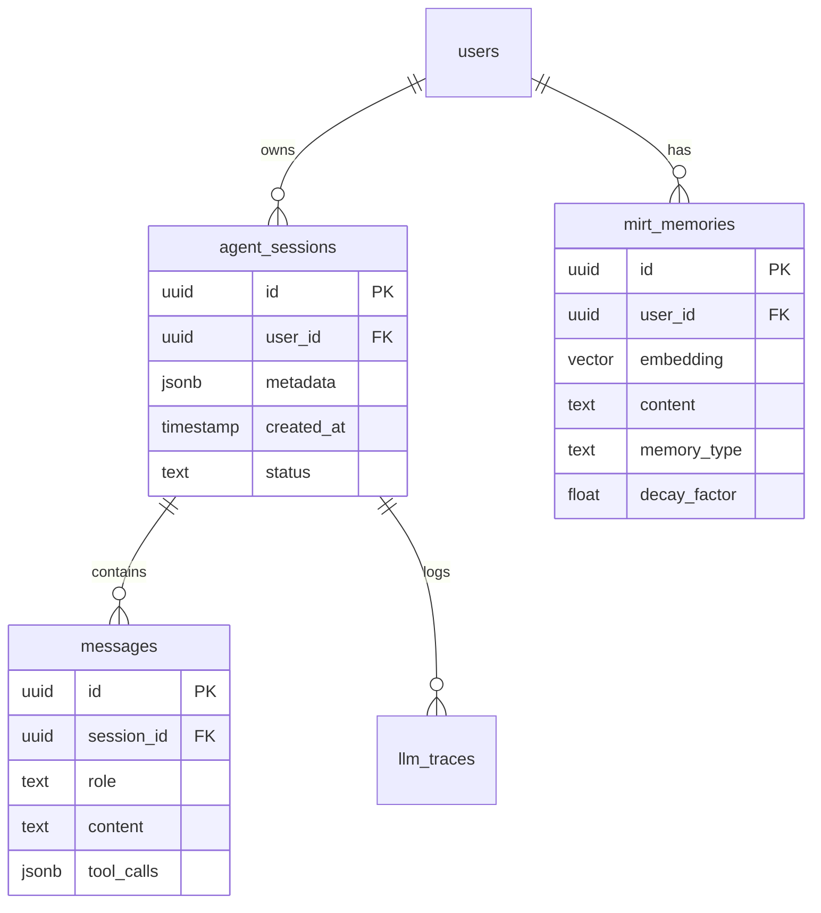

# 🗄️ Supabase Tables Roadmap

> **Версія:** 5.0  
> **Статус:** ✅ Active schema

---

## 📊 Schema Overview

---

## 📋 Core Tables

### 1. `agent_sessions`
Зберігає стан сесії LangGraph.

| Column | Type | Description |
|:-------|:-----|:------------|
| `session_id` | `text` | Telegram Chat ID / MC User ID |
| `checkpoint` | `bytea` | Serialized graph state |
| `metadata` | `jsonb` | Channel info, user profile |

### 2. `mirt_memories` (Vector Store)
Зберігає довгострокову пам'ять (Titans implementation).

| Column | Type | Description |
|:-------|:-----|:------------|
| `embedding` | `vector(1536)` | OpenAI embedding |
| `content` | `text` | Fact text |
| `importance` | `float` | 0.0 - 1.0 urgency |
| `last_accessed`| `timestamp` | For decay calculation |

---

## 🛠️ Planned Improvements (Roadmap)

### Q1 2026: Optimization

- [ ] **Partitioning:** Partition `messages` by month.
- [ ] **Archiving:** Move sessions > 3 months to cold storage (S3).
- [ ] **Indexing:** Add GIN index on `messages.metadata`.

### Q2 2026: Security

- [ ] **RLS Policies:** Strict Row Level Security per user.
- [ ] **Encryption:** Encrypt PII (phone, address) at rest.

---

> **Оновлено:** 20 грудня 2025, 13:54 UTC+2
