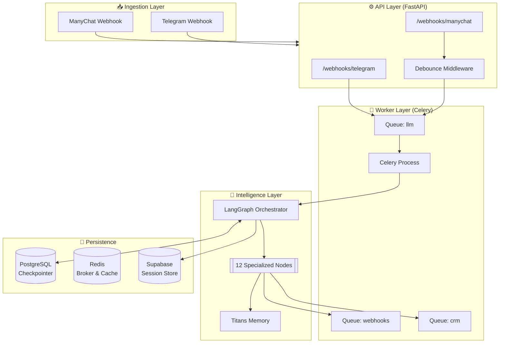

# 🏗️ MIRT AI — Enterprise Architecture

> **Version:** 5.1 (Production-Ready)  
> **SSOT:** `src/core/` & `src/agents/langgraph/`  
> **Updated:** 23 December 2025

---

## 🦅 High-Level System Overview

MIRT AI is an event-driven, stateful agentic system built on **LangGraph v2** and **Celery**. It processes user interactions from Telegram and Instagram (ManyChat) through a centralized pipeline.

---

## 🧩 Component Implementation Details

### 1. Ingestion & API (`src.server`)
- **Framework:** FastAPI
- **Endpoints:**
  - `GET /health`: Health check with dependency status
  - `GET /health/graph`: LangGraph-specific health check
  - `GET /health/agents`: PydanticAI agents health check
  - `GET /media/proxy`: Media proxy for images (optional, requires token)
  - `POST /webhooks/manychat`: ManyChat webhook with debouncing (window: 2s)
  - `POST /webhooks/telegram`: Telegram webhook (direct dispatch to Celery)
  - `POST /webhooks/snitkix/order-status`: Snitkix CRM order status updates
  - `POST /webhooks/snitkix/payment`: Snitkix CRM payment confirmations
  - `POST /webhooks/snitkix/inventory`: Snitkix CRM inventory updates
  - `POST /api/v1/sitniks/update-status`: Sitniks CRM status updates (for ManyChat/n8n)
  - `POST /automation/mirt-summarize-prod-v1`: Summarization automation
  - `POST /automation/mirt-followups-prod-v1`: Follow-up automation
  - `POST /webhooks/manychat/followup`: ManyChat follow-up webhook
  - `POST /webhooks/manychat/create-order`: ManyChat order creation webhook
- **Middleware:** Custom `MessageDebouncer` using Redis locks to merge rapid inputs, 404 error logging

### 2. Message Processing (`src.workers.tasks.messages`)
- **Task:** `process_message`
- **Queue:** `llm` (Time limit: 90s soft / 120s hard)
- **Logic:**
  1. Loads/Creates `ConversationState`.
  2. Invokes `graph.ainvoke` with `checkpoint_id`.
  3. Handles `Event` outputs (e.g., `SendResponse`, `UpdateCRM`).

### 3. Intelligence Engine (`src.agents.langgraph`)
- **Graph:** `StateGraph(ConversationState)`
- **Router:** `master_router` determines flow based on `dialog_phase`.
- **Persistence:** `AsyncPostgresSaver` (optimized connection pool).
- **HITL:** `interrupt_before=["payment"]` for human verification.

### 4. Integrations
- **ManyChat:** Push Mode (Async). See `src.integrations.manychat`.
- **CRM:** Snitkix API adapter. See `src.integrations.crm.snitkix`.
- **Vision:** OpenAI GPT-4o via `vision_node`.

---

## 💾 Data Flow & Storage

### PostgreSQL (Supabase)
Used for **Long-term State** and **Analytics**.
- `agent_sessions`: Stores LangGraph checkpoints (base64 serialized).
- `messages`: User and AI interaction history.
- `mirt_memories`: Vector embeddings (1536 dims) for Titans memory.

### Redis
Used for **Hot Data** and **Queues**.
- **Broker:** Celery task transport (db 0).
- **Debounce:** Ephemeral locks for message merging.
- **Cache:** User profiles and product catalog cache.

---

## 🛡️ Fault Tolerance

| Failure Mode | Mechanism | Implementation |
|:-------------|:----------|:---------------|
| **LLM Failure** | Retry/Fallback | `invoke_with_retry` (3 attempts, exp backoff) |
| **Checkpointer Failure** | Fail-fast + Fallback | AsyncPostgresSaver validation, fallback to MemorySaver |
| **Database Outage** | Graceful Degradation | Fallback responses, error escalation |
| **Worker Crash** | Task Recovery | `task_reject_on_worker_lost=True`, `acks_late=True` |
| **Rate Limits** | Backoff | `RateLimitError` handling in Celery |
| **CRM Outage** | Async Queue | `crm` queue with independent retry |
| **Redis Failure** | Degraded Mode | Catalog cache fallback to direct DB queries |

---

## 📚 Related Documents

- [AGENTS_ARCHITECTURE.md](AGENTS_ARCHITECTURE.md) - Deep dive into nodes.
- [CELERY.md](CELERY.md) - Queue configuration.
- [DEPLOYMENT.md](DEPLOYMENT.md) - Railwail setup.

---
