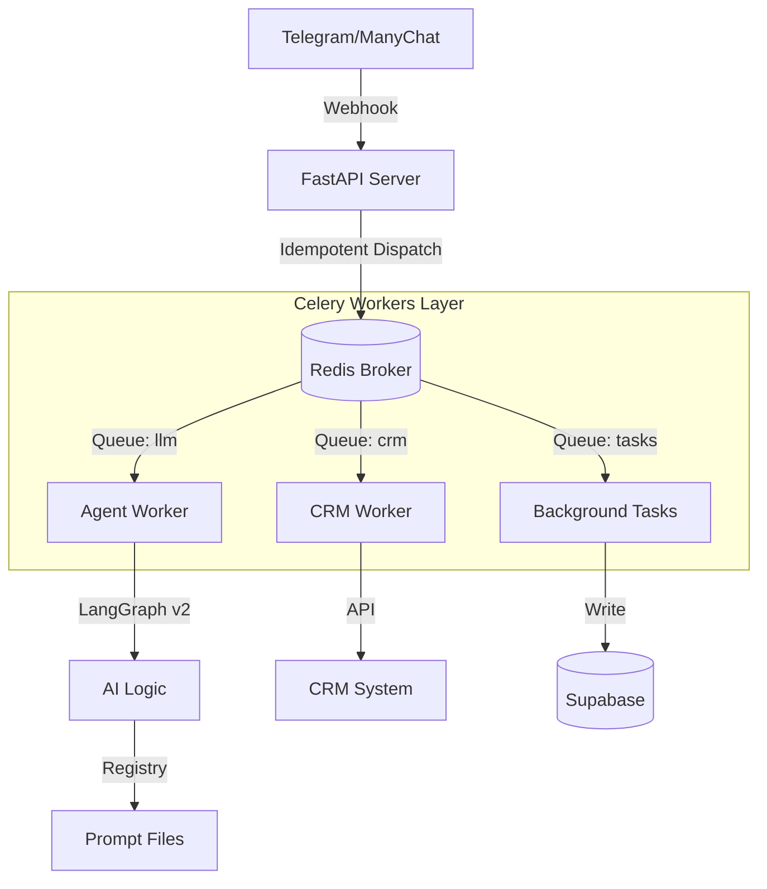

# Architecture v3.0: The Golden Era 🏛️

> ⚠️ **LEGACY DOC (v3.0)**
> Поточну архітектуру дивись у `DEV_SYSTEM_GUIDE.md` (розділ 3–4) та `PROJECT_STATUS_REPORT.md`.
> Цей файл збережено як історичний snapshot старої Celery‑орієнтованої архітектури і **не є Single Source of Truth**.

**Mirt-AI** is a production-grade AI stylist engine designed for reliability, scalability, and strict business compliance.

---

## 1. High-Level Overview

The system follows a **Queue-Based Event-Driven Architecture**. Use of `Celery` + `Redis` ensures that:
1.  **Users never wait** for sync HTTP calls.
2.  **Bursts of traffic** are buffered.
3.  **Failures are retried** automatically.

### Diagram

---

## 2. Core Components

### 🧠 The Brain: `src/agents/`
- **LangGraph v2**: A stateful graph with 5 nodes.
  - `moderation`: Guard against abuse.
  - `intent`: Classify user intent (Buy vs Support).
  - `agent`: Generate response using Pydantic AI.
  - `validation`: Regex-check output prices and URLs.
- **State Machine**: Deterministic transitions defined in `state_machine.py`. The LLM *proposes* moves, but code *executes* them.

### 📜 Prompt Registry: `src/core/prompt_registry.py`
The "Source of Truth" for AI behavior.
- **SSOT**: Prompts are loaded from `data/prompts/`.
- **Versioning**: Can serve different prompt versions (though currently v1 default).
- **Format**: Markdown files with clear `# Role` and `## Rules` sections.

### 👷 The Workers: `src/workers/` (The Engine)
This is a **10/10 Production System**.
- **Queues**:
  - `llm` (60s limit): Fast, interactive chat tasks.
  - `summarization` (120s): Heavy background processing.
  - `priority`: For paid users (future proofing).
- **Dispatcher** (`dispatcher.py`):
  - Handles **Idempotency** using message_id hashes.
  - Supports `Sync` mode for local dev (`CELERY_ENABLED=false`).
  - Generates `trace_id` for observability.
- **Usage Tracking** (`llm_usage.py`):
  - Calcluates cost per token (Input/Output).
  - Aggregates daily spend.

---

## 3. Data Flow (Life of a Message)

1. **Ingestion**: `POST /webhooks/telegram` receives JSON.
2. **Dispatch**: `dispatcher.dispatch_message()` creates a unique `task_id`.
3. **Queue**: Message pushed to Redis `llm` queue.
4. **Execution**: Celery Worker picks up task.
   - Loads conversation history from Supabase.
   - Runs LangGraph Agent.
   - Saves new state key-value.
5. **Response**: Result sent back to Telegram API.

---

## 4. Key Design Decisions

| Feature | Implementation | Why? |
| :--- | :--- | :--- |
| **Strictness** | Unit Tests verify Prompt Text | LLMs hallucinate rules; Code does not. |
| **Persistence** | Supabase (Postgres) | Structured history for long-term memory. |
| **Reliability** | Celery Retries + Dead Letter | Network blips shouldn't lose orders. |
| **Cost Control** | Token Tracking Table | Monitor spend per user/model/day. |
