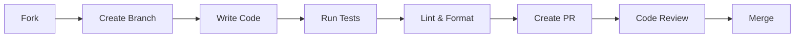

# 🤝 Contributing Guide

> **Версія:** 5.0  
> **Мова:** Українська

---

## 📋 Workflow



---

## 🌿 Branch Naming

| Type | Pattern | Example |
|:-----|:--------|:--------|
| Feature | `feat/description` | `feat/add-viber-support` |
| Bug Fix | `fix/description` | `fix/payment-timeout` |
| Docs | `docs/description` | `docs/update-readme` |
| Refactor | `refactor/description` | `refactor/state-machine` |
| Hotfix | `hotfix/description` | `hotfix/prod-crash` |

---

## ✅ Before Submitting PR

```bash
# 1. Format code
ruff format src/ tests/

# 2. Lint
ruff check src/ tests/

# 3. Run tests
pytest

# 4. Check types (optional)
mypy src/
```

---

## 📝 Commit Messages

```
<type>(<scope>): <subject>

<body>

<footer>
```

### Types

| Type | Description |
|:-----|:------------|
| `feat` | New feature |
| `fix` | Bug fix |
| `docs` | Documentation |
| `refactor` | Code refactoring |
| `test` | Adding tests |
| `chore` | Maintenance |

### Examples

```
feat(agents): add viber channel support

- Add ViperDispatcher class
- Update DispatcherFactory
- Add tests for new channel

Closes #123
```

```
fix(payment): handle timeout in CRM call

Increased timeout from 10s to 30s for Snitkix API.
Added retry logic with exponential backoff.
```

---

## 🔧 Development Setup

```bash
# Clone
git clone https://github.com/mirt-ua/mirt-ai.git
cd mirt-ai

# Setup
python -m venv venv
source venv/bin/activate
pip install --upgrade pip build
pip install -e ".[dev]"

# Configure
cp .env.example .env
# Edit .env

# Pre-commit hooks (recommended)
pip install pre-commit
pre-commit install
```

---

## 📁 Where to Add Code

| Adding... | Location |
|:----------|:---------|
| New LangGraph node | `src/agents/langgraph/nodes/` |
| New Celery task | `src/workers/tasks/` |
| New prompt | `data/prompts/` |
| New integration | `src/integrations/` |
| New service | `src/services/` |
| New test | `tests/` (no mocks) or `live_test/` (real services) |

---

## ⚠️ Important Rules

1. **Never commit `.env`** — use `.env.example`
2. **Always add tests** for new features
3. **Update documentation** when changing behavior
4. **Follow existing code style**
5. **Keep PRs focused** — one feature per PR

---

## 📚 Пов'язані документи

| Документ | Опис |
|:---------|:-----|
| [DEV_SYSTEM_GUIDE.md](DEV_SYSTEM_GUIDE.md) | Development guide |
| [TESTING.md](TESTING.md) | Testing strategy |
| [ARCHITECTURE.md](ARCHITECTURE.md) | System architecture |

---

> **Оновлено:** 20 грудня 2025, 13:35 UTC+2
