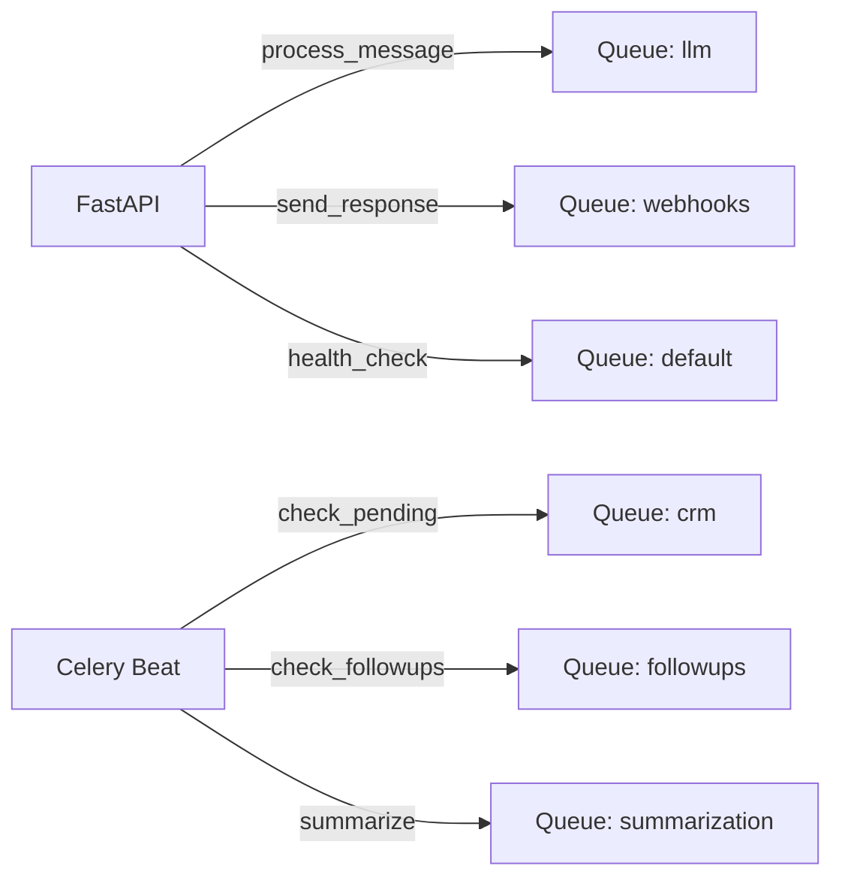

# ⚙️ Celery Workers Configuration

> **Version:** 5.0 (Implementation)  
> **Source:** `src/workers/celery_app.py`  
> **Updated:** 20 December 2025

---

## 🏗️ Queue Architecture

Matches `TASK_QUEUES` in `celery_app.py`:

---

## ⏱️ Queue Limits (Timeouts)

Defined in `QUEUE_TIME_LIMITS`:

| Queue | Soft Limit (s) | Hard Limit (s) | Purpose |
|:------|:---------------|:---------------|:--------|
| `llm` | 90 | 120 | Heavy AI processing (LangGraph) |
| `webhooks` | 10 | 20 | Rapid API calls (ManyChat/Telegram) |
| `followups` | 30 | 60 | Scheduling messages |
| `crm` | 30 | 60 | Snitkix integration |
| `summarization` | 120 | 180 | Context compression |
| `default` | 60 | 120 | Health checks, misc |

---

## ⏰ Beat Schedule (Periodic Tasks)

Exact configuration from `beat_schedule`:

| Task Name | Function | Schedule | Queue |
|:----------|:---------|:---------|:------|
| `health-check-5min` | `src.workers.tasks.health.worker_health_check` | 300s (5m) | `default` |
| `followups-check-15min` | `src.workers.tasks.followups.check_all_sessions_for_followups` | 900s (15m) | `followups` |
| `crm-orders-check-30min` | `src.workers.tasks.crm.check_pending_orders` | 1800s (30m) | `crm` |
| `summarization-check-1h` | `src.workers.tasks.summarization.check_all_sessions_for_summarization` | 3600s (1h) | `summarization` |
| `llm-usage-daily` | `src.workers.tasks.llm_usage.aggregate_daily_usage` | 86400s (24h) | `default` |

---

## 🔧 Worker Settings

| Environment Variable | Default | Logic in `celery_app.py` |
|:---------------------|:--------|:-------------------------|
| `CELERY_ACK_LATE` | `True` | Tasks acked *after* completion (reliability). |
| `CELERY_REJECT_ON_WORKER_LOST` | `True` | Re-queue task if pod crashes. |
| `CELERY_PREFETCH` | `1` | Fair distribution (1 task per worker). |
| `CELERY_MAX_TASKS_PER_CHILD` | `100` | Restart worker process after 100 tasks (prevents leaks). |

---

## 🚦 Task Routing

| Task Path | Queue |
|:----------|:------|
| `src.workers.tasks.messages.process_message` | `llm` |
| `src.workers.tasks.messages.process_and_respond` | `llm` |
| `src.workers.tasks.messages.send_response` | `webhooks` |
| `src.workers.tasks.manychat.*` | `llm` |
| `src.workers.tasks.crm.*` | `crm` |

---

## ⚠️ Error Handling

Custom exception overrides in `task_failure_handler`:

1. **`PermanentError`:** Logged as **WARNING**, no retry.
2. **`RateLimitError`:** Logged as **WARNING**, strict backoff.
3. **Other:** Logged as **ERROR**, auto-retry (backoff max 600s).

---
