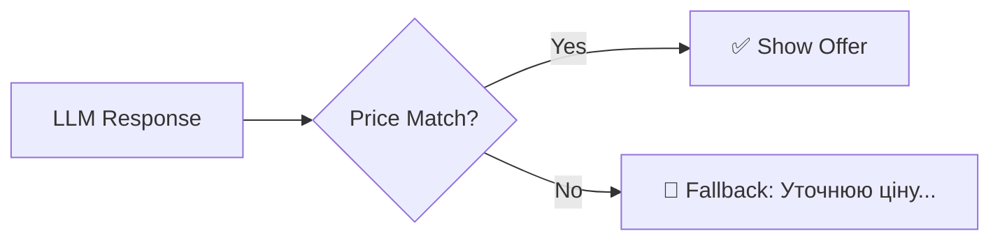

# 🛍️ Catalog Service — Вітрина Магазину

> **Роль:** "Storefront" (Вітрина)
> **Відповідальність:** Пошук товарів у базі даних, валідація цін, нормалізація назв від LLM.

Це **SSOT (Single Source of Truth)** для всіх операцій з продуктами.
Жоден інший модуль не ходить у `products` таблицю напряму.

---

## ⚠️ ЗАСТЕРЕЖЕННЯ (Safety Warning)

> 🔴 **КРИТИЧНО:** Цей сервіс є єдиним джерелом правди про ціни.
> Якщо його вимкнути, AI почне "галюцинувати" ціни (казати "1000 грн" замість реальних "2390 грн").
> Це може призвести до втрати грошей магазином.

---

## 🏗️ Структура

```
src/services/catalog/
├── __init__.py           # Експорти
├── catalog_service.py    # 🏢 Main: Postgres DAL + Ціни + Кешування
└── product_matcher.py    # 🔍 Helper: Нормалізація назв LLM→Canonical
```

---

## � Інтеграція з AI-Шаром (Deep Dive)

### 1. Vision Node (`nodes/vision.py`)
Коли юзер надсилає фото:
1.  **AI (GPT-4o Vision)** аналізує зображення і каже: "Це схоже на Костюм Лагуна".
2.  **Vision Node** викликає `CatalogService._enrich_product_from_db()`.
3.  **CatalogService** шукає "Костюм Лагуна" в Postgres і повертає:
    *   ✅ Реальну ціну з `price_by_size`.
    *   ✅ Доступні кольори.
    *   ✅ URL фото для відображення.
4.  **Vision Node** накладає ці дані на відповідь AI.

```python
# nodes/vision.py:333
enriched_row = await _enrich_product_from_db(
    response.identified_product.name,
    color=vision_color,
)
```

Без цього кроку AI міг би видумати ціну "1500 грн", коли реальна — "2390 грн".

---

### 2. Offer Node (`nodes/offer.py`) — Deliberation Pattern
Коли бот готовий показати оффер:



**Крок 1: PRE-VALIDATION (ДО LLM-виклику)**
```python
# nodes/offer.py:309
async def _validate_prices_from_db(products, session_id):
    for product in products:
        db_price = CatalogService.get_price_for_size(db_product, size)
        if abs(db_price - claimed_price) > claimed_price * 0.05:
            # ЦЕНА НЕ СОВПАДАЕТ! Исправляем.
            product["price"] = db_price
```

**Крок 2: POST-VALIDATION (ПІСЛЯ LLM-виклику)**
Якщо LLM все одно помилився (флаг `price_mismatch`), ми показуємо **fallback-повідомлення** замість неправильного оффера:
```python
FALLBACK_PRICE_MISMATCH = "Секундочку, уточнюю ціну по каталогу 🤍"
```

---

### 3. Dynamic Pricing (`get_price_for_size`)
Деякі товари мають різні ціни для різних розмірів:
| Розмір | Ціна |
| :--- | :--- |
| 119-134 | 1590 грн |
| 140-152 | 1850 грн |
| 158-176 | 2390 грн |

`CatalogService.get_price_for_size(product, "140")` поверне `1850`.

Це використовується:
*   В **Vision Node** (рядок 554): коли юзер каже "зріст 140 см".
*   В **Offer Node** (рядок 334): для валідації ціни.

---

## �️ Компоненти

### `CatalogService`
| Метод | Призначення |
| :--- | :--- |
| `search_products(query)` | Текстовий пошук (ILIKE). Кешується 2 хв. |
| `get_products_for_vision()` | Всі товари для промпту Vision AI. Кеш 5 хв. |
| `get_price_for_size(product, size)` | Ціна для конкретного розміру. |
| `format_price_display(product)` | "від 1590 до 2390 грн". |

### `ProductMatcher`
Перетворює "брудні" назви від LLM на канонічні (див. `data/vision/generated/canonical_names.json`).

---

## ⛔ Дублювання?

**Немає.**

| Файл/Таблиця | Роль |
| :--- | :--- |
| `data/products_master.yaml` | Human edits here (Source for sync). |
| `data/vision/generated/...` | Auto-generated for fast matching. |
| `products` (Postgres) | Runtime Source (bot reads here). |
| `src/services/catalog/` | API Layer (only way to access DB). |

Ланцюг: `YAML → scripts/sync → Postgres ← CatalogService ← AI Nodes`.

---

## 📝 Вердикт
Це **серце системи продажів** і **щит від галюцинацій AI**.
Кожна ціна, яку бачить клієнт, пройшла через цей сервіс.
