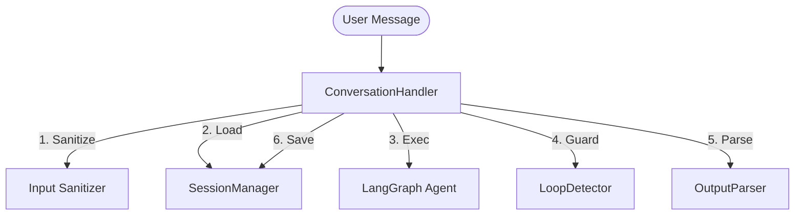

# 🧠 Conversation Handler — Центральна Нервова Система

> [!IMPORTANT]
> **CRITICAL COMPONENT / КРИТИЧНИЙ КОМПОНЕНТ**
>
> Цей модуль (`conversation.py`) є **Оркестратором (Orchestrator)** розмовної системи.
> Якщо `src/agents` — це "Мозок", то `ConversationHandler` — це "Нервова Система", яка з'єднує думки з діями.

## 🏗️ Архітектура: Orchestrator Pattern

Ми використовуємо патерн **Orchestrator**, де головний клас координує роботу спеціалізованих сервісів, не виконуючи бізнес-логіку самостійно.

---

## 📂 Компоненти Пакету (Deep Dive)

Кожен файл у цій директорії має чітку, єдину відповідальність (Single Responsibility Principle).

| Файл / Модуль | Роль | Опис Відповідальності (SSOT) |
| :--- | :--- | :--- |
| **`conversation.py`** | **Orchestrator** | Керування потоком, обробка помилок (Error Boundary), логіка повторних спроб (Retries), збір метрик (Observability). |
| **`session/manager.py`** | **Librarian** | Безпечне завантаження та збереження стану (`SessionStore`), ініціалізація нових сесій, робота з потоками (asyncio.to_thread). |
| **`guardrails/loop_detector.py`** | **Bodyguard** | Захист від зациклень. Аналізує історію переходів і блокує нескінченні цикли ("Groundhog Day protection"). |
| **`parser/output_parser.py`** | **Translator** | Перетворення ненадійного JSON від LLM у суворі Python-об'єкти (`AgentResponse`). Валідація схеми відповіді. |
| **`followups.py`** | **Strategist** | **Service Layer Logic.** Розраховує час наступного фоловапу (`due_at`) та генерує текст. *Не запускає сам себе* — це робить Worker. |
| **`debouncer.py`** | **Queue Manager** | Склеювання розірваних повідомлень (особливо для ManyChat/Instagram). Перетворює потік "Привіт" -> "Як справи" в одне повідомлення. |
| **`history_trimmer.py`** | **Janitor** | Очистка контексту. Обрізає старі повідомлення, щоб влізти в ліміт токенів LLM, зберігаючи системні промпти. |

---

## 🔄 Service Layer vs Workers Layer

Для `followups.py` (і подібних фонових задач) діє суворе правило архітектури **Separation of Concerns**:

1.  **Service (`src/services/conversation/followups.py`):**
    *   🧠 **"Мозок"**: Знає *ЯК* обчислити час, *ЩО* написати в повідомленні.
    *   🚫 **Обмеження**: Нічого не знає про Celery, Redis чи Cron. Чиста Python-функція.

2.  **Worker (`src/workers/tasks/followups.py`):**
    *   💪 **"М'язи"**: Відповідає за розклад (Cron), черги та інфраструктуру.
    *   ✅ **Дія**: Просто імпортує функцію з сервісу і викликає її.

---

## 🛡️ Надійність (Ironclad Guarantees)

Цей модуль спроектовано так, щоб **ніколи не падати** мовчки.

1.  **Top-Level Error Handling:** Весь процес в `process_message` обгорнутий у блок `try/except`.
2.  **Graceful Fallback:** При критичній помилці (помилка БД, збій LLM) користувач отримує нейтральне повідомлення ("Мені потрібно подумати..."), а система не крашиться.
3.  **Observability:** Кожен етап (load, invoke, save) пише логи та метрики (latency, success rate).

---

## 📋 Пам'ятка для Розробника

*   **Логіка діалогу/Промпти?** → Йди в `src/agents`.
*   **Формат БД?** → Йди в `src/core/models.py`.
*   **Як парситься JSON?** → Дивись `parser/output_parser.py`.
*   **Чому бот мовчить на часті повідомлення?** → Дивись `debouncer.py`.
*   **Чому зникли старі повідомлення?** → Дивись `history_trimmer.py`.

> [!NOTE]
> Цей код є архітектурним фундаментом. Зміни в `conversation.py` слід робити лише з крайньою обережністю і підтвердженням через **Golden Master Tests**.
