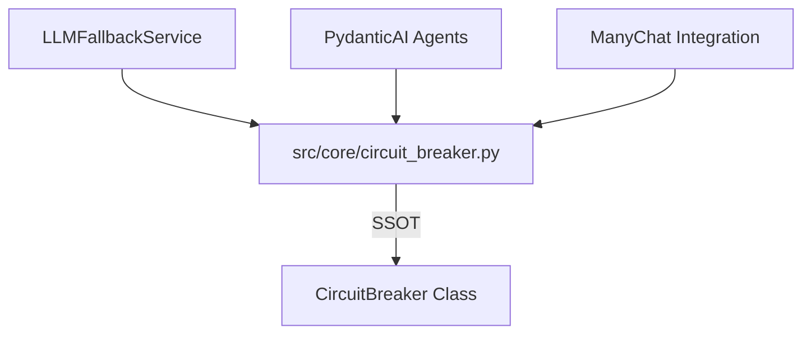

# 🤖 LLM Service — Мозковий Страхувальник

> **Роль:** "Brain Insurance" (Страхувальник AI)
> **Відповідальність:** Автоматичний fallback між LLM-провайдерами.

Це шар **High Availability** для AI-викликів.
Якщо OpenAI "лягає" або видає 429 (Rate Limit), система автоматично перемикається на OpenRouter.

---

## ⚠️ АРХІТЕКТУРНА ПРИМІТКА

> ℹ️ **CircuitBreaker:** Цей модуль **НЕ** має власної реалізації CircuitBreaker.
> Використовується `src/core/circuit_breaker.py` як **SSOT (Single Source of Truth)**.
>
> ```python
> from src.core.circuit_breaker import get_circuit_breaker
> ```

---

## 🏗️ Структура

```
src/services/llm/
├── __init__.py          # Експорти (re-exports CircuitBreaker from core)
├── llm_fallback.py      # 📢 Multi-Provider Fallback
└── README.md            # Ця документація
```

---

## 🛠️ Як це працює?

### Multi-Provider Fallback

```python
providers = [
    LLMProvider(name="openai", priority=1),      # Primary
    LLMProvider(name="openrouter", priority=2),  # Fallback
]
```

**Логіка виклику:**
```python
for provider in providers:
    if provider.circuit.can_execute():  # Uses core CircuitBreaker
        try:
            response = await client.chat.completions.create(...)
            provider.circuit.record_success()
            return response
        except (APIError, RateLimitError):
            provider.circuit.record_failure(error)
            continue  # → Next provider
```

---

## 🔗 Інтеграція з Core



---

## 📊 Health Status API

```python
from src.services.llm import get_llm_service

llm = get_llm_service()
status = llm.get_health_status()
# → {"providers": [...], "any_available": true}
```

---

## 📝 Вердикт
Це **страховий поліс** для AI.
Патерн Circuit Breaker тепер централізований у `src/core/`.
