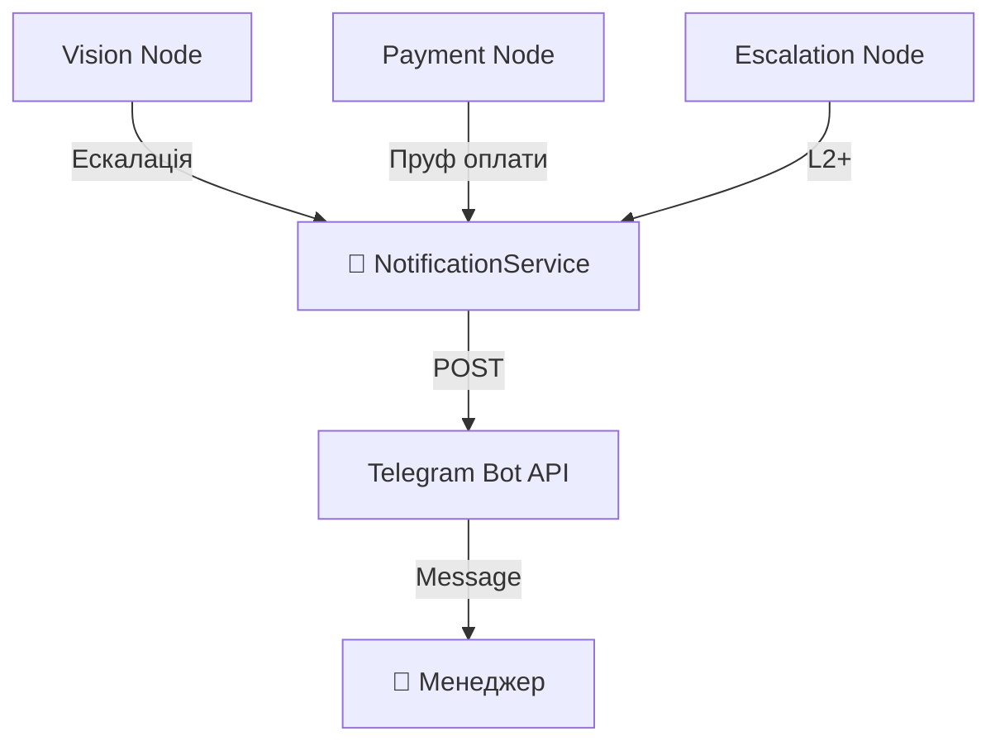

# 📢 Notifications Service — Диспетчерська

> **Роль:** "Dispatcher" (Диспетчерська)
> **Відповідальність:** Відправка критичних сповіщень менеджерам через Telegram.

Коли AI не може впоратися (ескалація) або клієнт надіслав оплату — цей сервіс оповіщає людину.

---

## ⚠️ ЗАСТЕРЕЖЕННЯ (Safety Warning)

> 🔴 **КРИТИЧНО:** Без цього модуля менеджери **не дізнаються** про ескалації.
> Клієнт буде чекати відповіді, а менеджер навіть не побачить повідомлення.

---

## 🏗️ Структура

```
src/services/notifications/
├── __init__.py              # Експорти
├── notification_service.py  # 📢 Main: Telegram API + Retry + Formatting
└── renderer.py              # 🖼️ Helper: AgentResponse → Text
```

---

## 🛠️ Компоненти

### 1. `NotificationService`
Головний клас для відправки Telegram-повідомлень менеджеру.

**Методи:**
| Метод | Призначення |
| :--- | :--- |
| `send_escalation_alert()` | Надіслати сповіщення про ескалацію. |
| `_send_telegram_message()` | Low-level: POST до Telegram API (text). |
| `_send_telegram_photo()` | Low-level: POST до Telegram API (photo + caption). |
| `_build_manager_message()` | Форматує багатий контекст (товари, оплата, клієнт). |

### 2. `renderer.py`
Допоміжні функції для перетворення `AgentResponse` у текст.

---

## ✅ Реалізація — Аналіз Надійності

### 1. Retry з Exponential Backoff
```python
for attempt in range(max_retries):
    try:
        response = await session.post(...)
        if response.status == 200:
            return True
        if response.status in (429, 5xx):
            backoff = min(0.5 * (2 ** attempt), 2.0)  # 0.5s → 1s → 2s
            await asyncio.sleep(backoff)
            continue
```
**Вердикт:** ✅ Правильно. Telegram API може тимчасово помилятися.

---

### 2. Private CDN Detection (Instagram/Facebook)
```python
is_private_cdn = (
    "lookaside.fbsbx.com" in image_url_str
    or "ig_messaging_cdn" in image_url_str
    or "fbcdn.net" in image_url_str
)
if is_private_cdn:
    # Telegram не може завантажити приватне фото → надсилаємо URL текстом
    return await self._send_telegram_message(message_with_url)
```
**Вердикт:** ✅ Правильно. Instagram CDN URL — приватні, Telegram їх не фетчить.

---

### 3. Markdown Fallback
```python
for parse_mode in ["Markdown", None]:
    if "parse entities" in resp_text:
        break  # Retry without Markdown
```
**Вердикт:** ✅ Правильно. Неправильний Markdown ламає повідомлення.

---

### 4. Message Truncation
```python
return self._truncate(message, 3900)  # Text: 4096 limit
caption_truncated = self._truncate(caption, 1024)  # Photo: 1024 limit
```
**Вердикт:** ✅ Правильно. Перевищення лімітів → Telegram відмовляє.

---

### 5. Rich Context in Alert
Менеджер бачить повний контекст:
```
🚨 Потрібен менеджер
Причина: vision_error
Session: `abc123`
Стадія: ESCALATED / STATE_0_INIT
Клієнт: Іван +380...
Доставка: Київ, Нова Пошта #5
Оплата: prepay, сума 2390, пруф: screenshot
Товари:
- Костюм Лагуна (140, голубий) ₴2390
Останнє від клієнта:
Хочу такий костюм як на фото
```

---

## 🔗 Інтеграція (Usage Map)

| Файл | Коли викликається |
| :--- | :--- |
| `nodes/vision.py` | Фото не розпізнано → Ескалація. |
| `nodes/escalation.py` | Будь-яка ескалація L2+. |
| `nodes/helpers/vision/escalation.py` | Vision-специфічні ескалації. |
| `nodes/helpers/payment/delivery.py` | Оплата підтверджена. |
| `nodes/upsell.py` | Апсейл потребує менеджера. |
| `conversation/conversation.py` | Критичні помилки. |
| `bot/telegram_bot.py` | Рендеринг відповідей. |

---

## 📊 Архітектурна Діаграма



---

## 📝 Вердикт
Реалізація **Production-Ready**:
*   ✅ Retry з Backoff.
*   ✅ CDN detection.
*   ✅ Markdown fallback.
*   ✅ Truncation (4096/1024).
*   ✅ Rich context.

Жодних проблем не знайдено.
