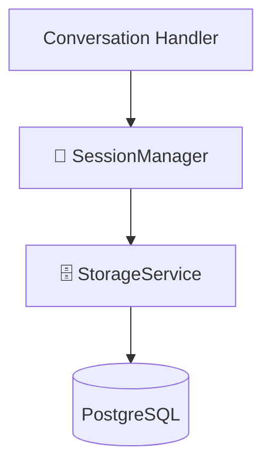

# 📇 Session Service — Бібліотекар

> **Роль:** "Librarian" (Бібліотекар)
> **Відповідальність:** Керування життєвим циклом сесії, ініціалізація та валідація даних.

Це **Business Logic Layer** для сесій.
Він не працює з базою напряму (це робить `Storage`), він працює з **правилами**.

---

## 🏗️ Архітектура (Layered)

| Шар | Модуль | Відповідальність |
| :--- | :--- | :--- |
| **Logic** | `src/services/session/manager.py` | "Якщо сесії немає — створи нову. Якщо є — перевір поля." |
| **Data** | `src/services/storage/...` | "SELECT * FROM sessions..." |

---

## � Де використовується? (Usage)

Цей сервіс має **єдиного клієнта**:
**`src/services/conversation/conversation.py`**

Він є приватним помічником для основного Оркестратора.
Воркери та інші сервіси не звертаються до `SessionManager`, вони або читають базу напряму (для швидкості), або використовують `Storage`.

Це гарантує **SSOT** (Single Source of Truth) для логіки створення сесії в реальному часі.

---

## �🛠️ Що робить `SessionManager`?

Він вирішує проблеми, про які ви навіть не думали:

1.  **Timeouts (`load_session`):**
    *   Якщо база "залагала", менеджер чекає рівно **2.5 сек**.
    *   Якщо відповіді немає — він видає **Empty State**, щоб користувач не чекав вічно.

2.  **Factory (`_create_empty_state`):**
    *   Новий користувач? Менеджер створить правильний `STATE_0_INIT` з усіма потрібними полями (`metadata`, `step_number`).

3.  **Sanitizer:**
    *   Він чистить "брудні" прапори. Наприклад, якщо в минулому повідомленні була картинка (`has_image=True`), то в наступному цей прапор треба скинути. Менеджер це робить автоматично.

4.  **Trace ID:**
    *   Генерує `trace_id` для кожного запиту, щоб ми могли відслідкувати шлях повідомлення в логах.

---

## 📝 Вердикт
Це **не дублювання**.
`Storage` — це "склад" (SQL).
`Session` — це "завгосп" (Logic).
Вони ідеально доповнюють одне одного.
